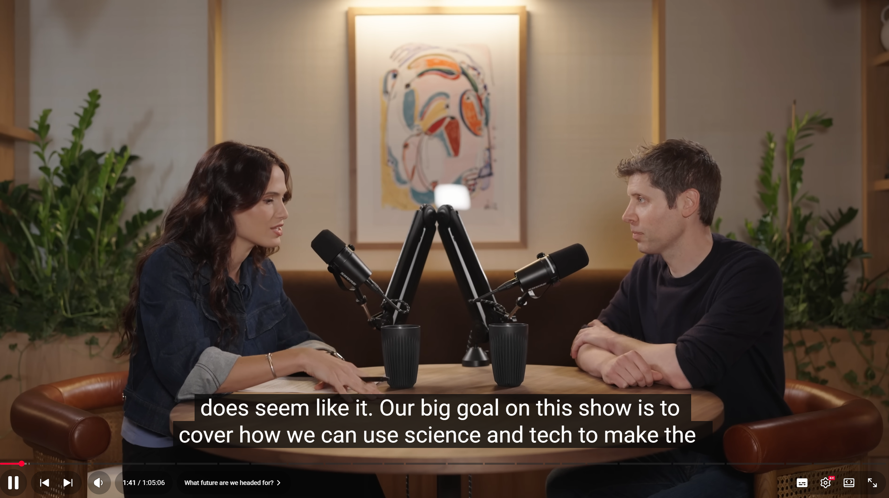

# Listening Journal II - SEIII

## Title

**Sam Altman Shows Me GPT 5… And What’s Next** (Huge Conversations with Cleo Abram)

## URL

https://www.youtube.com/watch?v=hmtuvNfytjM&list=PLF-HhhjMki5mV1OrDe5YkVkS8UIi4lY7m

## Summary

In this interview, Sam Altman and Cleo Abram discussed about GPT-5’s role and trajectory - it's described as a more general, faster assistant which can turn your prompts into code or working apps. And it can collaborate fluently across text, images and voice.

For the impact and risks, Altman emphasized the gradual deployment and strong safety practices to avoid scaling without enough guards.

What's more, he also talked about the opportunities for individuals, that the lower friction of AI tools can let people verify their ideas faster and scale the creativity into reality.

## Vocabulary

### agentic

adj. Capable of autonomously completing multi-step tasks like an agent.

e.g.: An agentic system can plan, browse docs, write code, and test it with minimal prompting.

### context window

phrn. The amount of text (in tokens) an LLM can consider at once.

e.g.: A larger context window lets the assistant read a long report before answering.

### latency

n. The time between input and model output during inference.

e.g.: Multimodal generation usually has higher latency than plain text replies.

### hallucination

n. When a model produces confident but nonsensical or inaccurate content.

e.g.: Retrieval and source citations can significantly reduce hallucination.

## Reflection

I chose this interview for it has pictured the next-generation assistant, which is not just Q&A, but an catalyst that turns ideas into products. This video is easy to understand but conveyed significant messages. In this video, the most inspiring is that the point that small team or individual can also produce real things faster and more precise, which reshaped my view on learning and entrepreneurship.  At the same time, I also agree with the opinion that the implement of AI needs better guards. Currently I've already tried the GPT-5 which really impressed my for its supereminent behavior.