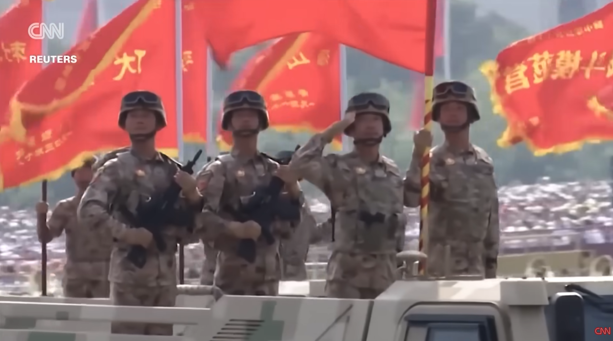

# Listening Journal IV - SEIII

## Title

**Satellite images show dramatic growth of China’s military production sites**(CNN)

## URL

https://www.youtube.com/watch?v=9-P8xVixnf8

## Summary

The video of CNN showcased the great growth of China via the prospective of satellite, in which the number of missile-related facilities in China was found increasing rapidly. This story emphasized why these facilities are significant, and how this power will affect the international situation. And that illustrates the gargantuan change of China.

## Vocabulary

### Arsenal

n. The collection or stock of weapons and military equipment a country possesses.

e.g.: Analysts warned that a rapidly expanding arsenal could alter the regional balance。

### Deterrence

n. The strategy of preventing conflict by convincing an opponent that the costs of aggression would outweigh any gains.

e.g.: Officials framed missile deployments as deterrence, not escalation.

### Satellite imagery

phrn. Pictures of Earth collected by orbiting satellites, often used to monitor construction, terrain, or military activity.

e.g.: Investigators relied on satellite imagery to verify new buildings at multiple sites.

## Reflection

I chose this video because it turns a complex defense topic into visuals so that I can understand it without massive background knowledge. The clarification was clear and logical, and the specific number of facilities made it more persuasive. What's more, the satellite images also illustrated the exactly circumstances. Which is to say, the video made me deeply understand the rapid development of our great country.