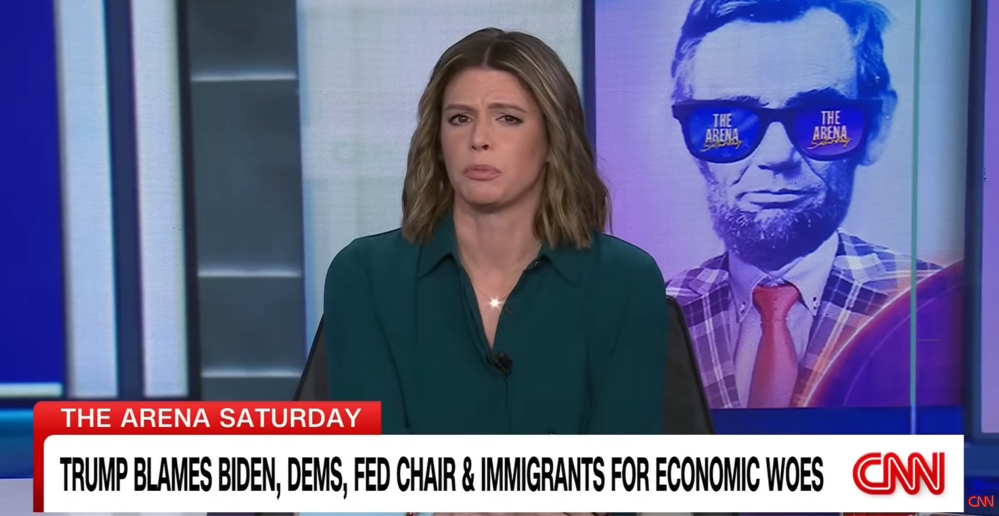

# Listening Journal IX - SEIII

## Title

**Trump blames Biden, Dems, Fed chair and immigrants for economic woes**

## URL

https://www.youtube.com/watch?v=xXZ84hWnRdI

## Summary

This CNN clip showcases President Trump saying who he thinks caused today’s economy. He points to President Biden, Democrats in Congress, Federal Reserve chair Jerome Powell, and immigrants. He says Democrats created an “affordability” crisis and that the Fed was late on interest rates. Host Kasie Hunt and the panel ask if blaming others works when you are the president. They note that people still feel high prices in daily life, thus talking points may not change minds. The discussion says voters want clear steps to cut costs, instead of just finger-pointing.

## Vocabulary

### Inflation

n. A general rise in prices over time.

e.g.: Inflation makes groceries and rent more expensive.

### Federal Reserve chair

phrn. The head of the U.S. central bank.

e.g.: Some blame the Federal Reserve chair for moving too slowly.

### Scapegoat

n.  A person or group unfairly blamed for problems.

e.g.: Critics say immigrants are used as a scapegoat in economic debates.

## Reflection

I chose this video since it is short but clear. It uses simple language to explain the quotes. I learned that blame is not a plan, and it does not lower prices by itself. People feel costs every day, so they want actions compared with slogans. The clip also reminds me to check claims before I believe them. Overall, it was useful and fairly balanced. It pushed individuals to look for specific steps, like lowering housing and energy costs, improving childcare, and helping wages keep up.

