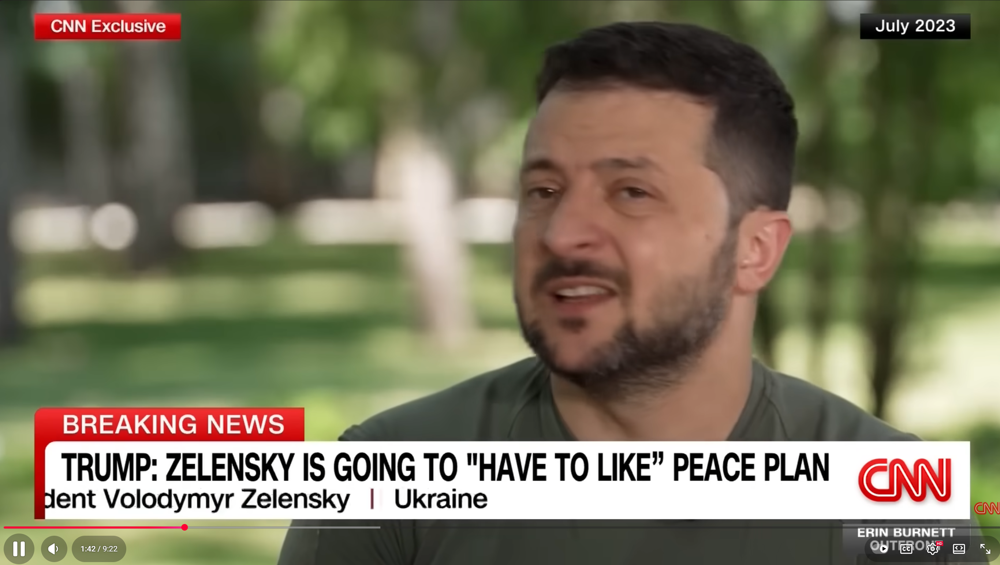

# Listening Journal VI - SEIII

## Title

**Trump pushes Russia-Ukraine deal that gives Putin almost everything he wants**

## URL

https://www.youtube.com/watch?v=DcPODJ3woAs

## Summary

This CNN video showcased that President Trump is pushing a Russia-Ukraine deal which includes 'land swapping' or ceding parts of Donbas to obtain a freeze of front lines. Some think that this might be the Kremlin’s demands, which emphasized Trump’s preference on a peace agreement directly instead of a temporary ceasefire.

## Vocabulary

### Territorial concession

phrn. Giving up control of land to another state as part of a negotiation.

e.g.: Ukraine has repeatedly rejected territorial concessions as unconstitutional.

### Security guarantees

phrn. pl. Formal promises by other countries to defend or protect a state if attacked.

e.g.: An Article-5-like security guarantee has been floated as a substitute for NATO membership.

### Leverage

n. The power to influence outcomes in a negotiation.

e.g.: Observers say the proposal may increase Moscow’s leverage if it locks in gains.

## Reflection

I chose this video since it expressed the transformation of diplomacy, which is from temporary ceasefire to full-peace deal. What impressed most is the one-sided concessions could also be a 'peace', which demonstrated the perplexing global situation. In this video, I learned both of Russia and Ukraine's red lines to the end of the war. Nevertheless, the inner conflict would ultimately lead to a concession. Overall, the video is clear and in detail, which pushed me to learned the confront deeper.