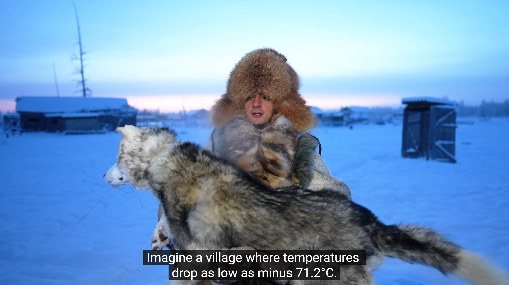

# Listening Journal VII - SEIII

## Title

**The Coldest Village on Earth: Oymyakon (-71°C, -96°F)**

## URL

https://www.youtube.com/watch?v=2C8zYFArnKY

## Summary

This video showcased the extremely cold environment of Oymyakon in Yakutia, the coldest permanently inhabited settlement on Earth. In which the temperature can drop below -50°C with an unofficial regional low to -71°C. What's more, the life here is also specialized. For instance, the car must keep in heated in garages of running to avoid freezing. The video emphasized how the residents endure the strict environment.

## Vocabulary

### Permafrost

n. Permanently frozen ground that stays below 0°C for years.

e.g.: Many homes in Oymyakon are built on piles to protect the permafrost beneath them.

### Frostbite

n. Injury caused by freezing of skin and underlying tissues.

e.g.: At −50°C, exposed fingers can develop frostbite in minutes.

### Insulation

n. Material that slows heat loss.

e.g.: Thick boots and fur-lined jackets provide crucial insulation during outdoor chores.

## Reflection

I chose this video since it's extremely interesting and attractive. It explained what to wear, when to drive, even how to breathe in this strict environment in detail. And seeing breath becoming glittering crystals made the science reachable. Plus, I obtained that in that place, the  official lowest temperature record is −67.7°C and the unofficial is -71°C. The totally different living style really astonished me, that we shall never underestimate the power of nature.