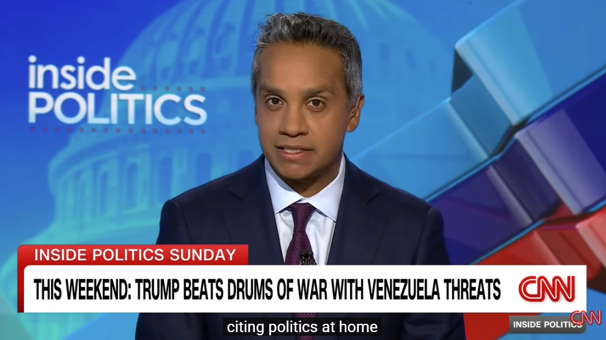

# Listening Journal VII - SEIII

## Title

**Is Trump about to start a new war in Venezuela?**

## URL

https://www.youtube.com/watch?v=WZVvCuo63Bw

## Summary

This video explains the continuous rising tension between the United States and Venezuela. It showcased the message that posted on social media by President Trump, which says airlines and pilots should treat Venezuelan airspace as 'closed in its entirety'. This signal also represents a higher pressure on President Nicolás Maduro. And the video clarifies the multiple risks: miscalculation, legal limits, regional fallout, etc. 

## Vocabulary

### Escalation

n. A rise in tension or conflict step by step.

e.g.: Closing airspace can lead to escalation if both sides react strongly.

### Sanctions

n.pl. Official limits or bans to punish a government.

e.g.: The U.S. may add sanctions to increase pressure.

### Regime change

phrn. Forcing or pushing a government to be replaced.

e.g.: Critics say the policy could aim at regime change.

## Reflection

I chose this video since it explains a serious issue in simple words, like the 'airspace closed', which is easy to understand but with strong effects. Which is to say, all the events that relevant to the airline will be closed. What's more, I also learned that a simple post can even change that lots of circumstances and affect multiple aspects. Nevertheless, hope the two sides can avoid a large conflict eventually.