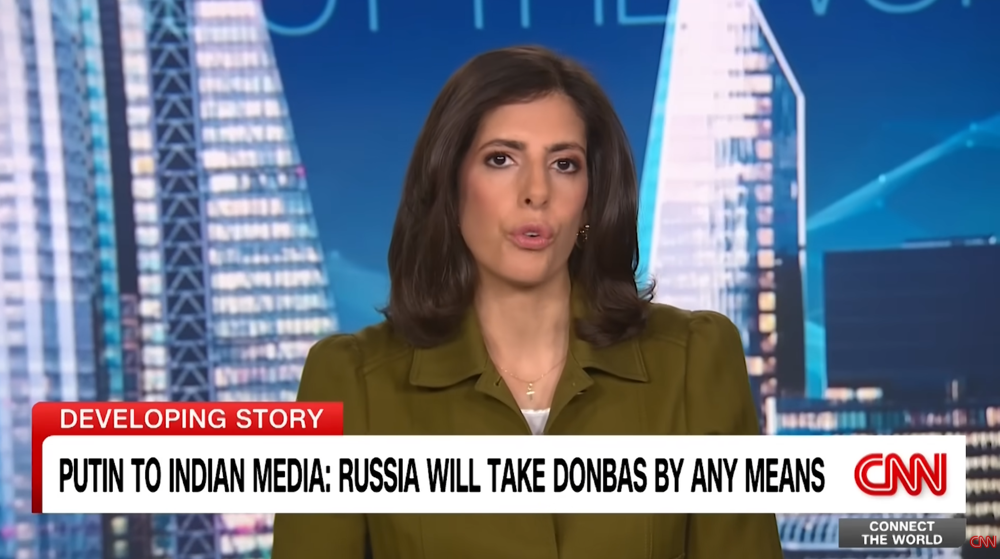

# Listening Journal VIII - SEIII

## Title

**Putin vows Russia will seize Donbas region by any means**

## URL

https://www.youtube.com/watch?v=rXcJZAdcvjw

## Summary

This CNN video reported that President Putin said Russia would take Ukraine’s Donbas region 'by military or other means.' Which hardened Russia's position while Ukrainian officials prepared for more peace talks. For details, the video explained that the statement was both a military threat and a negotiating signal. And for the backdrop, Putin’s high-profile trip to New Delhi for meetings with India’s Prime Minister Narendra Modi and recent contacts with U.S. envoys. Therefore, the current circumstances are as tense but fluid, which is to say, negotiations continue, yet each side is trying to improve leverage on the battlefield and at the table.

## Vocabulary

### Ultimatum

n. A final demand that, if rejected, may lead to force or punishment.

e.g.: Saying Donbas will be taken “by any means” sounds like an ultimatum before talks.

### Annexation

n. Taking and declaring control of another state’s territory.

e.g.: Any deal must address past annexation claims and occupied areas.

### Sovereignty

n. A country’s right to govern itself without outside control.

e.g.: Kyiv says sovereignty over its land cannot be traded away.

## Reflection

I chose this video since it shows how words can affect outcomes in a war and in diplomacy. The phrase “by any means” is short, but it carries gargantuan meaning: pressure, timelines, and potential military steps. The video was clear and easy-to-understand, in which I learned to watch the timing of statements—Putin spoke when peace talks were coming and foreign trips were in motion, which implies the potential purposes. Nevertheless, hope the peace between the two country will coming soon.