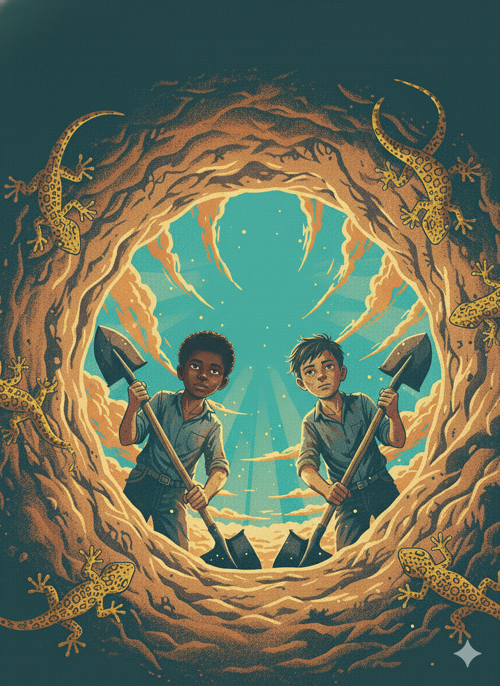

# Reading Journal IV - SEIII

I'm using ChatGPT5 Thinking to offer me original prompts to generate AI pictures, then modify it manually, and use Google Nano Banana(Gemini 2.5 flash image) to generate the cover.

Here are the prompts:
Book cover illustration, worm’s-eye view from inside a deep desert hole looking up at a turquoise sky; two dusty kids (Stanley and Zero) peek over the rim with shovels; yellow-spotted lizards cling to the sandy walls; rays of sun and drifting dust motes; Texas desert palette (sun-bleached oranges, ochres, teal); WPA/1930s screen-print poster style with subtle paper grain and halftone shading; dramatic composition with circular vignette; leave clean negative space at top for title; no text on image, PG, no gore, highly detailed, sharp focus, 1.85:2.6.

