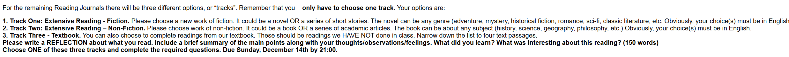

# Reading Journal IX - SEIII

## Track II

- **Title:** Being Logical: A Guide to Good Thinking

- **Author:** D. Q. McInerny

- **Reflection:**

  The book says we should separate what’s relevant from what’s just pressure. An appeal to pity asks for sympathy instead of reasons, like “Please pass my examination, since I worked all night.” Effort is not evidence. An appeal to force uses a threat: “Support the proposal if you care about your job.” Both can silence people, but neither of them showcases what is true. Currently I always use a simple evidence test in emails and meetings, which is, delete the emotional or coercive line and see what still connects the premise to the conclusion. Therefore, the strongest point wasn’t a video or an “inspiration” story in a speech or presentation. This isn’t to ban emotion—stories can help—but each story should pass the baton to evidence. Relevance gives an argument a base, and loudness is only noise.
