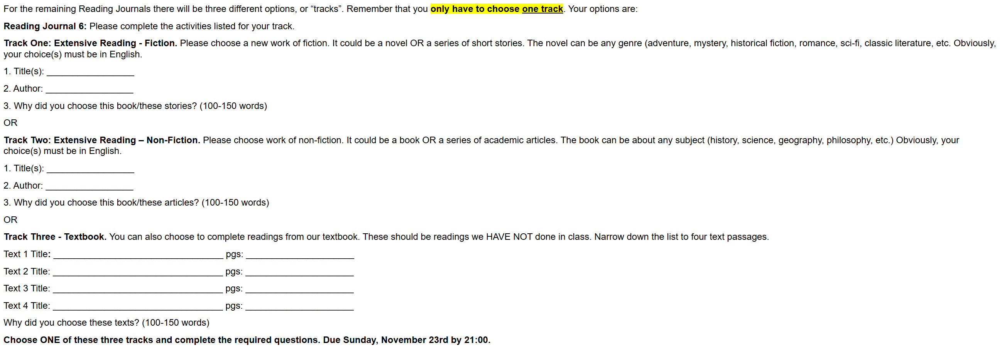

# Reading Journal VI - SEIII

## Track II

- **Title:** Being Logical: A Guide to Good Thinking

- **Author:** D. Q. McInerny

- **Reasons to choose this book:**

  I chose this book since it's a short, clear and plain-spoken but powerful handbook which is a regular tool I will use every day. In this book, the author explains how to make sound claims, define terms precisely, and link premises to conclusions, then he illustrates some common fallacies—ad hominem, straw man, false dilemma, post hoc, e.t.c.. I also hope to reshape my arguments and discussions, i.e., make them more persuasive and logical, thus, I'm determined to read this book and consider it as a practical tool instead of a time killer.

