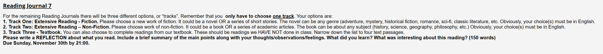

# Reading Journal VII - SEIII

## Track II

- **Title:** Being Logical: A Guide to Good Thinking

- **Author:** D. Q. McInerny

- **Reflection:**

  This bool is tiny, plain-spoken and easy-to-understand, but still explains how logic works briefly, clearly and effectively. The book is divided into five parts—preparing the mind for logic, basic principles, the language of argument, sources of illogical thinking, and the principal forms of fallacies, which makes the structure clear and formal. Besides, what I learned most was to define terms before arguing, and to check whether the conclusion follows all the premises. And the fallacies—ad hominem, straw man, false dilemma, and post hoc are also extremely common on our daily life. I also noticed the opening reminder that logical thinking begins with a mindset—attention, humility, and a focus on facts—not with symbols. Nevertheless, I think my words will become more and more logical and persuasive since I finished this book.

