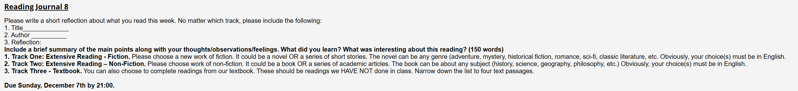

# Reading Journal VIII - SEIII

## Track II

- **Title:** Being Logical: A Guide to Good Thinking

- **Author:** D. Q. McInerny

- **Reflection:**

  I think the most practical and useful lesson is how language affects conclusions. For instance, ambiguity: the river bank vs. lender bank, amphiboly: 'Visiting relatives can be boring.' can be understand as two ways. What's more, we should make the charge more measurable and testable, like transform 'This policy is unfair!' to 'This fee rises 20% for A but 5% for B'. Plus, I also spotted another pitfall called loaded questions, like 'Have you stopped wasting water?', which has already assumed guilt. And for applying the principle of charity, we should restate the opposing view in its strongest, clearest form before replying. Then, McInerny’s simple fix, prefer plain nouns and active verbs, also helped a lot, which made the conversation more clear and understandable. All these measures will help us walk onto the shortest path to accuracy and respect effectively.
