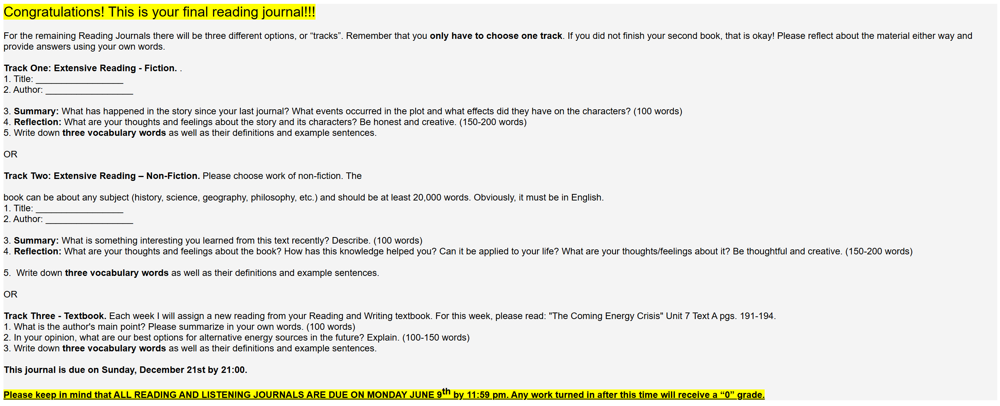

# Reading Journal X - SEIII

## Track II

- **Title:** Being Logical: A Guide to Good Thinking

- **Author:** D. Q. McInerny

- **Summary:**

  In this book, I learned that an argument is not just “an opinion”, but a set of reasons that support a conclusion. One idea that impressed me a lot is the difference between a valid argument and a true conclusion. An argument can be valid if the conclusion follows from the premises, even if the premises are false. The book also explains common mistakes, like attacking the person instead of the point, or using one example to claim something is always true. This helped me notice when I am being convinced by style, not logic. Now I'll check the reasons before agreeing.

- **Reflection:**

  I chose this book because it explains logic in a clear, practical way. It did not feel like a school textbook, instead, it felt like someone teaching you how to think step by step. While reading, I realized I often jump to a conclusion first and then look for support. However, the book reminded me to slow down and ask: What are the premises? Are they true? Do they really lead to the conclusion? This knowledge helps me in daily life. When I read news online or watch short videos, I try to notice emotional language and check whether there is real evidence. In class discussions, I can disagree more politely by focusing on the idea, not the person. I also use these ideas in writing: I try to define key words and avoid making claims that are too broad. Overall, the book makes me feel more confident, because good thinking is a skill I can practice.

- **Vocabulary**:

  ### Premise

  n. A reason or statement that supports a conclusion.

  e.g.: My premise is that practice improves skills, so I should study daily.

  ### Fallacy

  n. A mistake in reasoning that makes an argument weak.

  e.g.: Saying “he is rude, so his idea is wrong” is a fallacy.

  ### Deduce

  v. To reach a conclusion by using facts and logic.

  e.g.: From the evidence, we can deduce that the plan will not work.
